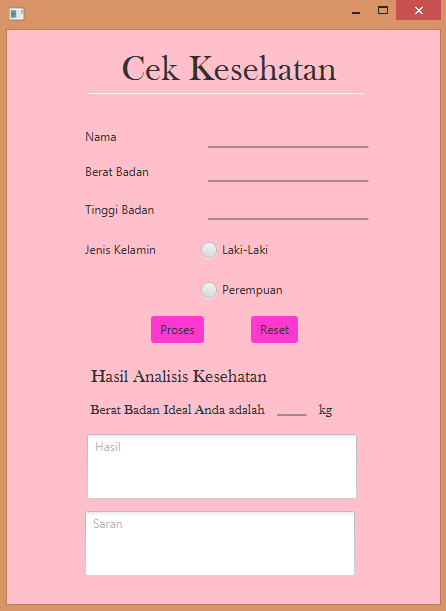

# Kuis_Kesehatan

Ketika program dijalankan maka output yang ditampilkan adalah seperti berikut

Setelah itu, kita bisa menginputkan data kita. Contohnya kita menginputkan data tinggi dan berat badan wanita yang nantinya akan di proses untuk mengetahui apakah dia sudah ideal atau belum.

Dan apabila kita menginputkan data tinggi dan berat badan orang laki-laki maka contohnya seperti berikut

Dan apabila awalnya kita memproses data dengan jenis kelamin laki-laki kemudian diubah ke jenis kelamin perempuan masih dengan data yang sama maka output yang ditampilkan adalah seperti berikut

menjadi

Kemudian, apabila kita menekan button reset maka semua data yang ada akan terhapus.

